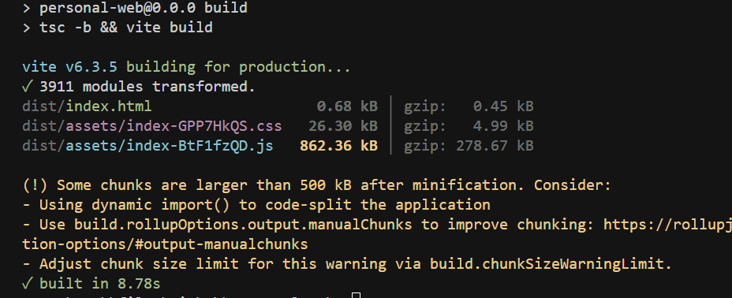
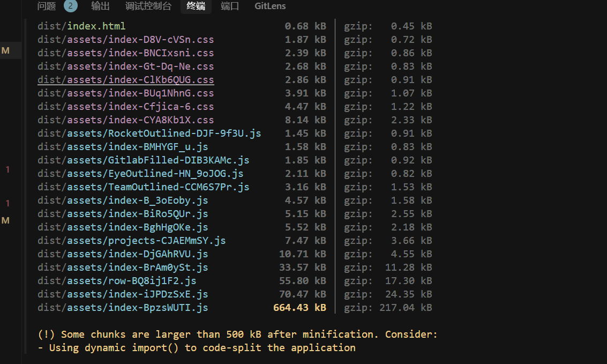
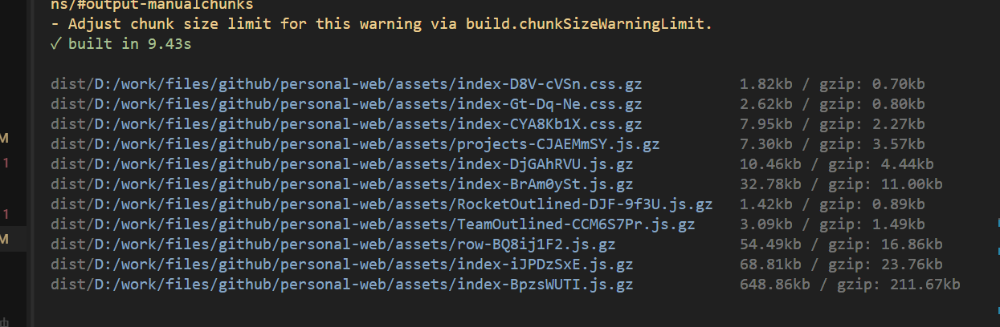
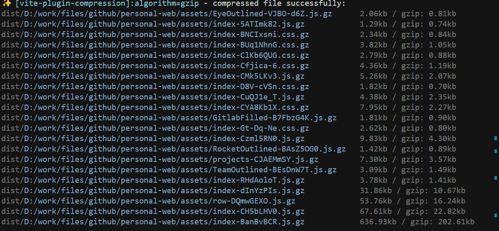

# 项目性能优化手段

## 初始状态：



## 优化后：


## 1. 懒加载

通过 懒加载 可以减少页面初次加载的资源，从而加快页面的渲染速度，包体大小拆分了。

```js
const Home = lazy(() => import("./pages/Home"));
const Skills = lazy(() => import("./pages/Skills"));
const Experience = lazy(() => import("./pages/Experience"));
const Projects = lazy(() => import("./pages/Projects"));
const Works = lazy(() => import("./pages/Works"));
const Contact = lazy(() => import("./pages/Contact"));
```



## 2.打包体积压缩 gzip、terser

```js
export default defineConfig({
  plugins: [
    react(),
    // 启用 Gzip/Brotli 压缩
    viteCompression({
      algorithm: "gzip", // 或 'brotliCompress'
      ext: ".gz",
    }),
    // 打包分析工具
    visualizer({
      open: true,
      gzipSize: true,
      brotliSize: true,
    }),
  ],
  build: {
    minify: "terser", // 使用terser进行更强的压缩
    terserOptions: {
      compress: {
        drop_console: true, // 移除console
        drop_debugger: true, // 移除debugger
      },
    },
    reportCompressedSize: false, // 提高构建速度
    chunkSizeWarningLimit: 1000, // 提高警告限制
  },
});
```

### gzip 压缩效果：优化几十 kb



### terser 压缩效果：优化几十 kb



## 3. 分包策略

通过手动分包，可以将一些常用的库单独打包成一个文件，这样可以减少主包的体积，加快页面加载速度。

### 手动指定分包：

```js
// vite.config.ts
export default defineConfig({
  // ...其他配置
  build: {
    rollupOptions: {
      output: {
        manualChunks: {
          'react-vendor': ['react', 'react-dom', 'react-router-dom'],
          'antd-vendor': ['antd', '@ant-design/icons'],
          ...
        },
        //   manualChunks(id) {
        //   if (id.includes('node_modules')) {
        //     return id.toString().split('node_modules/')[1].split('/')[0].toString();
        //   }
        // },
      },
    },
  },
});
```

## 4. CDN 加载第三方库

```js
export default function CdnInjectPlugin(): Plugin {
  // 定义需要通过CDN加载的依赖
  const cdnModules: CdnModule[] = [
    {
      name: 'react',
      var: 'React',
      path: 'https://cdn.jsdelivr.net/npm/react@18.3.1/umd/react.production.min.js',
    },
    {
      name: 'react-dom',
      var: 'ReactDOM',
      path: 'https://cdn.jsdelivr.net/npm/react-dom@18.3.1/umd/react-dom.production.min.js',
    },
    {
      name: 'dayjs',
      var: 'dayjs',
      path: 'https://cdn.jsdelivr.net/npm/dayjs@1.11.10/dayjs.min.js',
    },
    {
      name: 'antd',
      var: 'antd',
      path: 'https://cdn.jsdelivr.net/npm/antd@5.26.1/dist/antd.min.js',
      css: 'https://cdn.jsdelivr.net/npm/antd@5.26.1/dist/reset.css',
    },
    {
      name: '@ant-design/icons',
      var: 'icons',
      path: 'https://cdn.jsdelivr.net/npm/@ant-design/icons@6.0.0/dist/index.umd.min.js',
    },
  ];

  return {
    name: 'cdn-inject-plugin',
    config(config) {
      // 确保 build 配置存在
      config.build = config.build || {};
      config.build.rollupOptions = config.build.rollupOptions || {};

      // 设置外部依赖
      const external = cdnModules.map(dep => dep.name);
      config.build.rollupOptions.external = external;

      // 设置全局变量映射
      const globals = cdnModules.reduce((prev, current) => {
        prev[current.name] = current.var;
        return prev;
      }, {} as Record<string, string>);

      // 确保 output 配置正确
      config.build.rollupOptions.output = {
        ...(config.build.rollupOptions.output || {}),
        globals,
        format: 'iife', // 使用 IIFE 格式，确保全局变量可用
      };

      return config;
    },
    transformIndexHtml(html) {
      // 生成CSS链接
      const cssLinks = cdnModules
        .filter(dep => dep.css)
        .map(dep => `<link rel="stylesheet" href="${dep.css}">`)
        .join('\n');

      // 生成JS脚本链接 - 确保按顺序加载
      const scriptLinks = cdnModules
        .map(dep => `<script defer crossorigin src="${dep.path}"></script>`)
        .join('\n');

      // 1. 先将主 JS 的 script 标签替换为 defer
        // html = html.replace(
        //   /<script[^>]*type="module"[^>]*src="([^"]+)"[^>]*><\/script>/,
        //   '<script defer src="$1"></script>'
        // );
      // 将链接插入到第一个 script 标签之前，确保 CDN 脚本先加载
      return html.replace(
        /<script[^>]*src="[^"]*"[^>]*>/,
        `${cssLinks}\n${scriptLinks}\n$&`
      );
    },
  };
}
```

不 cdn react：

- 包体：216kb;
- FCP: 0.5s;
- LCP 0.6s;
- 二次加载没有影响。

只 cdn react 相关包：

- 包体 216kb -> 183kb;
- FCP: 0.5s - 0.7s;
- LCP：0.6s -> 0.7s,
- 二次加载时间 0.7s -> 0.7s

2025/07/13 更新：

### 打包配置修改：通过 cdn 加载第三方包。

```js
config.build.rollupOptions.output = {
  ...(config.build.rollupOptions.output || {}),
  globals,
  format: "iife", // 使用 IIFE 格式，确保全局变量可用
};
```

- 包体 1.99M -> 103kb (优化原因： 通过 cdn 加载第三方包，减少打包体积。)
- FCP: 0.5s -> 0.38s (优化原因：减少打包体积，加快加载速度。)
- LCP: 0.9s -> 1.1s (LCP 增加原因：首次加载时，需要下载第三方库的资源。二次加载时，已经缓存了这些资源，因此速度更快。)
- 第二次加载时间 FCP：0.38s -> 0.14s (优化原因：缓存第三方库资源，加快加载速度。)
